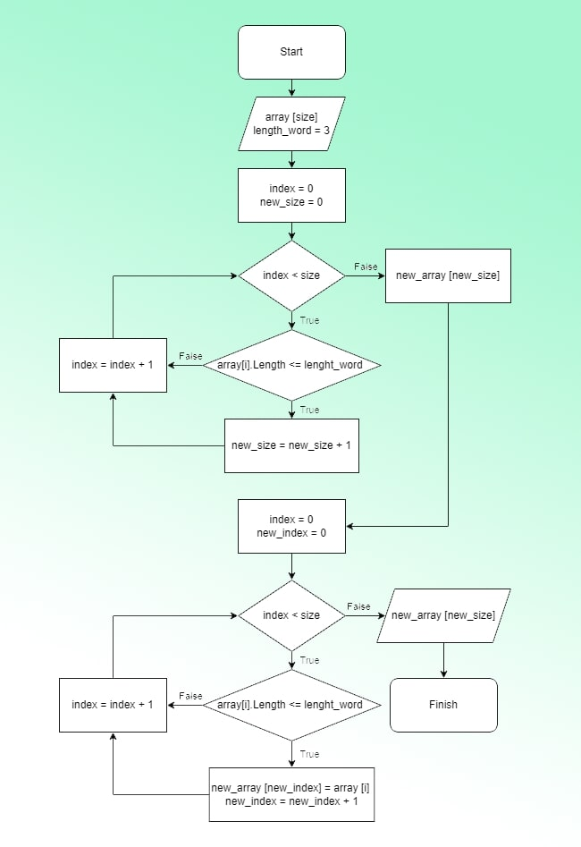

# Progect *"Control"*
## Task
___

Программа принимает на вход массив из строк с различным количеством символов в строках, выдает новый массив из строк с длинной до 3 символов. 

## Algorithm
___

## Result
___

Вход : ["Hello", "World", "10", "abc"] → Выход : ["10", "abc"]
